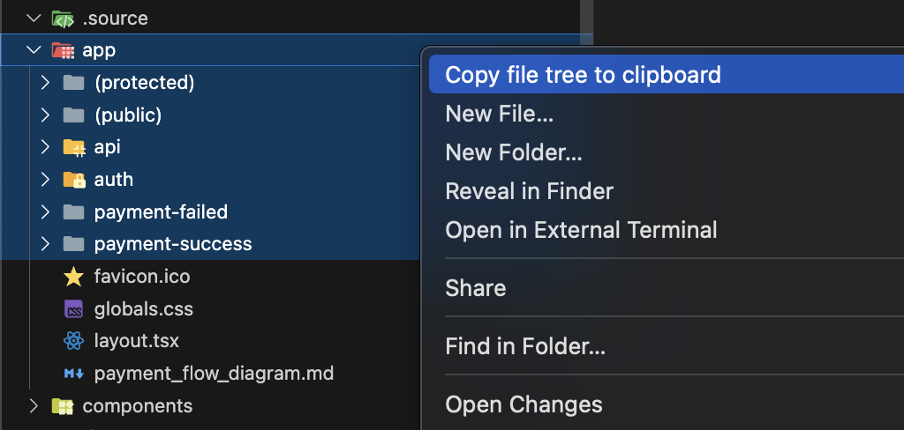
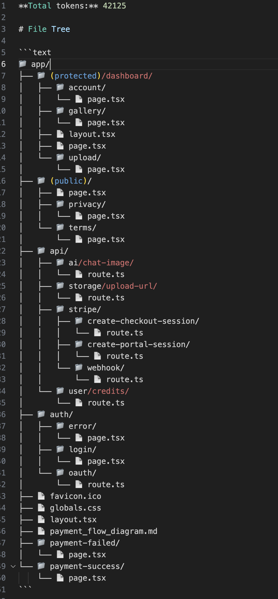
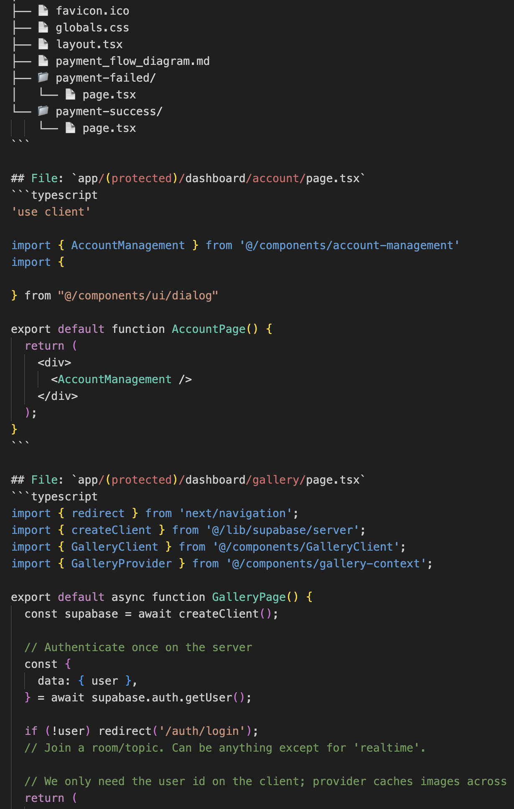

# Copy File Tree Extension

A VS Code/Cursor extension that copies selected files and directories as a structured Markdown tree with complete file contents. Perfect for sharing code context with AI assistants, creating documentation, or reporting issues.

## How to Use

1. **Select files or folders** in the VS Code/Cursor explorer (you can select multiple items)
2. **Right-click** to open the context menu  
3. **Click "Copy file tree to clipboard"**

<div align="center">
  <table>
    <tr>
      <td align="center" colspan="2"><b>Context Menu</b></td>
    </tr>
    <tr>
      <td align="center" colspan="2"></td>
    </tr>
    <tr>
      <td align="center"><b>File Tree Structure</b></td>
      <td align="center"><b>Clipboard Content</b></td>
    </tr>
    <tr>
      <td></td>
      <td></td>
    </tr>
  </table>
</div>

The extension copies a formatted tree structure with all file contents to your clipboard. The output includes:
- A visual directory tree showing the structure
- Each file's complete source code in fenced code blocks
- Proper syntax highlighting when pasted into Markdown-compatible platforms

## What it does

This extension allows you to:
- **Select multiple files and folders** in the VS Code/Cursor explorer
- **Right-click** and choose "Copy file tree to clipboard" 
- **Get a formatted output** that includes:
  - A visual directory tree structure in Markdown
  - Complete source code of each file in fenced code blocks
  - File paths and line numbers for easy reference

The output is optimized for pasting into:
- AI chat interfaces (ChatGPT, Claude, etc.)
- GitHub issues and discussions
- Documentation and wikis
- Code review tools

## Installation

### Prerequisites
Make sure you have Node.js installed on your system.

### Install the Extension

1. Clone or download this repository
2. Run the installation script:

```bash
chmod +x install_extension.sh
./install_extension.sh
```

This script will:
- Install the VS Code Extension CLI (`vsce`) globally
- Install project dependencies 
- Package the extension into a `.vsix` file
- Install the extension in Cursor/VS Code

### Manual Installation (Alternative)

If you prefer to install manually:

```bash
# Install vsce globally
npm i -g @vscode/vsce

# Install dependencies
npm install

# Package the extension
vsce package --allow-missing-repository 

# Install in Cursor
cursor --install-extension copy-file-tree-0.0.1.vsix

# Or install in VS Code
code --install-extension copy-file-tree-0.0.1.vsix
```

