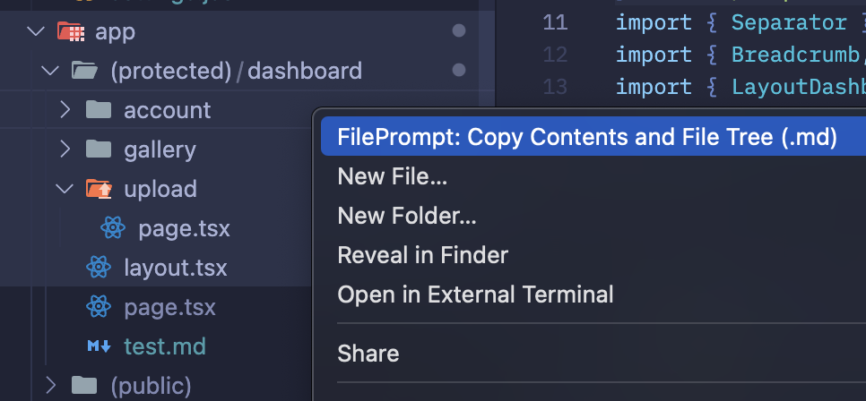

# Copy File Tree Extension

A VS Code/Cursor extension that copies selected files and directories as a structured Markdown tree with complete file contents. Perfect for sharing code context with AI assistants, creating documentation, or reporting issues.

## How to Use

1. **Select files or folders** in the VS Code/Cursor explorer (you can select multiple items)
2. **Right-click** to open the context menu  
3. **Click "Copy file tree to clipboard"**

<div align="center">
  <table>
    <tr>
      <td align="center" colspan="2"><b>Context Menu</b></td>
    </tr>
    <tr>
      <td align="center" colspan="2"></td>
    </tr>
    <tr>
      <td align="center"><b>File Tree Structure</b></td>
      <td align="center"><b>Clipboard Content</b></td>
    </tr>
    <tr>
      <td></td>
      <td></td>
    </tr>
  </table>
</div>

The extension copies a formatted tree structure with all file contents to your clipboard. The output includes:
- A visual directory tree showing the structure
- Each file's complete source code in fenced code blocks
- Proper syntax highlighting when pasted into Markdown-compatible platforms

## What it does

This extension allows you to:
- **Select multiple files and folders** in the VS Code/Cursor explorer
- **Right-click** and choose "Copy file tree to clipboard" 
- **Get a formatted output** that includes:
  - A visual directory tree structure in Markdown
  - Complete source code of each file in fenced code blocks
  - File paths and line numbers for easy reference

The output is optimized for pasting into:
- AI chat interfaces (ChatGPT, Claude, etc.)
- GitHub issues and discussions
- Documentation and wikis
- Code review tools

## Installation

### From VS Code Marketplace (Recommended)
1. Open VS Code/Cursor
2. Go to Extensions (`Ctrl+Shift+X`)
3. Search for "Copy File Tree"
4. Click Install

### Manual Installation (Development)
1. Clone this repository
2. Run the installation script:

```bash
chmod +x install_extension.sh
./install_extension.sh
```

## Development

### Prerequisites
- Node.js (version 14 or higher)
- VS Code or Cursor

### Setup
```bash
# Clone the repository
git clone https://github.com/JoaoJanini/create_prompt_from_cursor_explorer_extension.git
cd create_prompt_from_cursor_explorer_extension

# Install dependencies
npm install

# Package the extension
npm run package

# Install locally
npm run install-local
```

